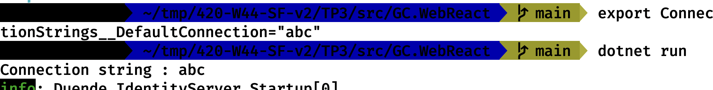

# Travail pratique 3 - Déploiement d'une application web dans Kubernetes

## Informations

- Remise du travail: 7 février 2023, 23:59
- Ce travail est réalisé en équipe de 2 personnes et seuls les membres de cette équipe y contribuent
- Toutes les réponses fournies doivent être originales (produites par l’étudiant ou un membre de l’équipe)
- Toute copie de code, de portion de code, d’algorithme ou de texte doit faire mention de sa source
- L’emprunt ou la copie de code ou de portions de code est interdite
- Tout constat de plagiat, tricherie ou fraude sera automatiquement déclaré à la Direction et les sanctions prévues seront appliquées
- Durée : 3 x 3 heures + travail à la maison
- Plate forme : Docker, Kubernetes, Visual Studio Code et dotnet/react
- Pas d'utilisation de Visual Studio (vous êtes des DevOps et l'entreprise ne paie pas de licence pour cela) : vous devez tout faire ne ligne de commande

## Objectifs

- Créer une image de conteneur Docker pour une application web
- Effectuer le déploiement d'une base de données SQL Server dans Kubernetes
- Effectuer le déploiement d'une application web dans Kubernetes
- Utiliser 3 environnements de déploiement (dev, test, prod)
- Être capable d'expliquer la partie théorique et technique

## Remise

- Vidéo sur YouTube (non listée - autour de 10 mins maximum ! Pénalités si dépassé !) (50 points):
  - Explication du fichier Dockerfile (10 points)
  - Explication des fichiers YAML de déploiement (10 points)
  - Explication de l'architecture de déploiement (10 points) (Lien entre les fichiers sources, les images Docker, les fichiers YAML de déploiement et les environnements de déploiement)
  - Démonstration du fonctionnement de l'application sur les trois environnements (10 points)
  - Démonstration de la mise à l'échelle de l'application web sur au moins un environnement (10 points)
- Fichiers YAML et Dockerfile (30 points)
- Répartition des tâches entre partenaires avec nombre d'heures par partenaire et total (5 points)
- Répondre à la question suivante (15 points):
  - En quoi l'utilisation de Docker et de Kubernetes peut aider les équipes de développements ?
- Fichier `AUTHORS.md` : (Jusqu'à -10 points pour non respect des consignes)
  - lien YouTube
  - Vos informations (prénom / nom / matricule)
  - le fichier doit être remis dans l'archive zip sur Léa

En résumé, ce qui est noté est ce qui est dans l'archive zip sur Léa à l'exception de la vidéo sur YouTube dont je dois trouver le lien dans le fichier `AUTHORS.md`.

## Projet

Le projet est écrit en .Net 6.0. Il se trouve dans le répertoire ```src``` du présent répertoire.

Pour modifier la configuration de la chaîne de connexion et écraser les valeurs du fichier `appsettings.json`, vous pouvez utiliser les variables d'environnement. Par exemple, pour modifier la valeur de `ConnectionStrings.DefaultConnection` dans le fichier `appsettings.json`, vous pouvez utiliser la variable d'environnement `ConnectionStrings__DefaultConnection` : le point est remplacé par deux underscores.



## Étape 1 - Création d'un fichier Dockerfile

Vous devez créer une image Docker pour l'application Web (GC.WebReact). Vous devez publier l'image sur Docker Hub en public. L'adresse de l'image doit être dans le fichier `AUTHORS.md`.

Pour vous remémorer comment containériser une application avec Docker, vous pouvez consulter la documentation suivante : [Tutorial: Containerize a .NET app](https://learn.microsoft.com/en-us/dotnet/core/docker/build-container?tabs=linux).

Si vous prenez l'image `mcr.microsoft.com/dotnet/sdk:6.0`, n'oubliez pas que vous pouvez installer des paquets avec la commande `apt-get install`.

## Étape 2 - Création des fichiers YAML de déploiement

Vous devez créer les fichiers YAML de déploiement pour déployer l'application Web (GC.WebReact) dans Kubernetes. Vous devez créer un fichier YAML pour chaque environnement de déploiement (unitaire, acceptation, production).

Chaque environnement doit :

- Être isolé dans un namespace Kubernetes
- Être configuré à l'aide de configmaps et de secrets
- Les fichiers YAML doivent être réutilisables d'un environnement à l'autre (Seuls les configmaps et secrets doivent être différents). Si les configmaps ne sont pas utilisable pour certaines sections de vos fichiers YAML, n'oubliez pas que vous pouvez toujours lancer un script qui remplace des textes par d'autres comme vous le faisiez dans les releases avec Azure DevOps
- Le conteneur contenant le serveur de bases de données doit avoir les tags suivants :
  - app : GC.WebReact
  - tier : database
- Le conteneur contenant le serveur de bases de données doit être limité en ressources (CPU + RAM) sinon votre ordinateur va souffrir
- Le conteneur contenant l'application Web doit avoir les tags suivants :
  - app : GC.WebReact
  - tier : web
- Seules le tier web de chaque environnement doit être exposé à l'extérieur du cluster Kubernetes :
  - unitaire : port 30000
  - acceptation : port 30001
  - production : port 30002
  
## Informations supplémentaires
  
  Pour forcer le port d'exposition du site web, vous pouvez utiliser la variable d'environnement `ASPNETCORE_URLS`. Voici un exemple de valeur pour exposer le site sur le port 5000 : `ASPNETCORE_URLS=http://+:5000`

Tout partage de code, d'explication, de bouts de texte, etc. est considéré comme du plagiat. Pour plus de détails, consultez le site (et ses vidéos) [Sois intègre du Cégep de Sainte-Foy](http://csfoy.ca/soisintegre) ainsi que [l'article 6.1.12 de la PÉA](https://www.csfoy.ca/fileadmin/documents/notre_cegep/politiques_et_reglements/5.9_PolitiqueEvaluationApprentissages_2019.pdf)

## Bonus

- plus petit image docker de la cohorte 5%
- Validation de la santé du conteneur 5%
- Un seul ensemble de fichiers YAML pour tous les environnements
